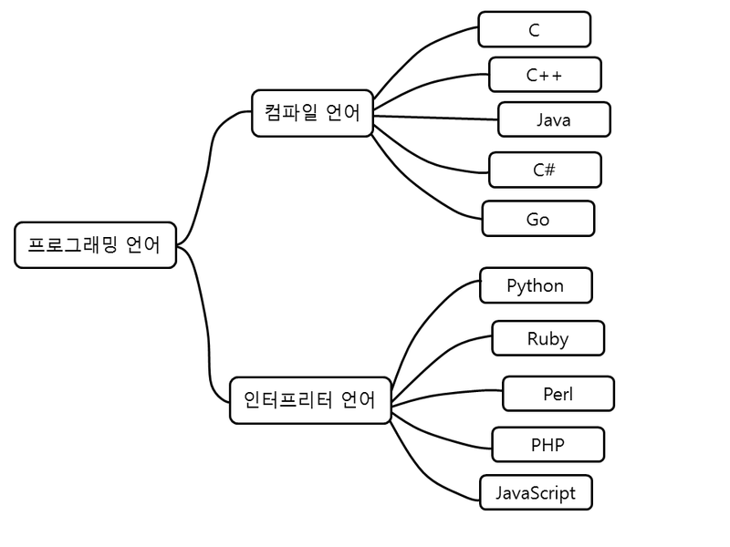
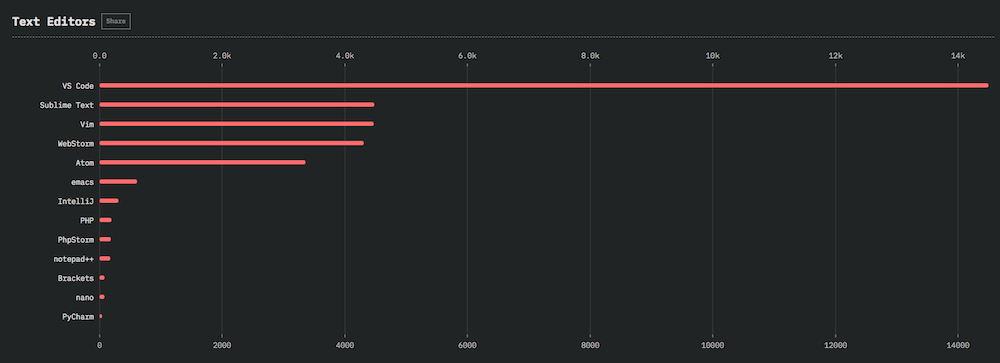
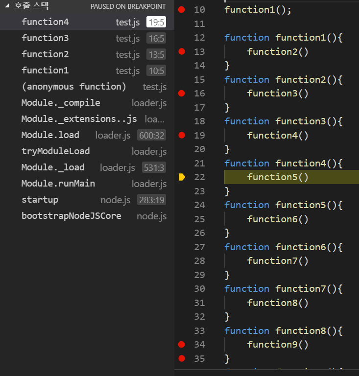

# 프로그래밍 언어

## 인터프리터 언어 컴파일 언어
- 기계어 -> 어셈블리어 -> C언어 순으로 개발
- C-> C++, C##, Objective-C, Swift, Java, Python

### 컴파일언어
- C C++ java C# GO
- 작성한 언어를 컴파일을 통해 기계어로 번역
- 실행속도가 빠르고 보안성이 높다

### 인터프리터 언어
- Python Ruby Perl PHP JavaScript
- 한줄한줄 번역, 실행하는 방식
- 컴파일언어보단 느리지만 빠르게 수정 가능
- 보안성이 떨어짐

###javaScript
- script언어 형태
    - imperative(명령형)
    - functional(함수형)
    - declarative(선언적)
    - event-driven(이벤트중심)

## 어떻게 배울수있나
- API(application protocol interface)는 다른 프로그래밍간의 관계를 정의하는 방법으로 알려져있다.
- 라이브러리의 경우 그 메소드에 대한 설명을 API Documents 라고 한다. 
- API Docs

### 검색 노하우
- 구글 영어검색
- 영어권 최신버전 문서
- MDN이라는 사이트가 JS에 대한 설명으로 유용
- 메서드 사용법(어떤타입 파라미터 필수고 옵션인가, 반환값은?) 에 정확히 알아야함
- API Docs 에선 브라우저 지원범위도 보자
- Stackoverflow 사이트 친숙해지기

## NodeJS
- nodejs 를 통해서 js를 브라우저 이외의 공간에서 실행할수 있음

## IDE
- IDE 통합 개발환경 (Intergrated Development Environment)
- JavaScript IDE

## 온라인 에디터
- 코드를 간단히 테스트하고 다른사람과 공유할 필요가 있다
- codepen.io, code sandbox와 같은 사이트 연습

# vscode-nodejs debugging
- 공식 홈페이지 디버깅 방법 공부해보기

## 디버그 단축키
- Ctrl + Shift + D : 디버그 view 열기
- F5 : 디버그 시작
- Ctrl + F5 : 디버깅 없이 디버그(run)
- F5 : continue/pause
- F10 : Step Over
- F11 : Step Into
- shift + F11 : Step Out
- shilft+F5 : Stop
### Step over, into, out
1. Step Over
    - 해당 함수 내에서 한줄씩 실행
2. Step Into
    - 한줄씩 실행
    - 호출되는 함수가 있으면 호출되는 함수로 이동
3. Step Out
    - 현재 함수를 실행하고 호출 전 함수로 이동

## Break point
- F9로 브레이크 포인트 추가
- 빨간 점 : 브레이크포인트
- 회색 점 : 사용안하는 브레이크 포인트

## Advanced breakpoint
### 조건부 breakpoint = Conditional breakpoint
1. Expression condition
    - 조건 설정이 가능
    - true 인 경우 동작
2. Hit count
    - 정해준 숫자만큼 포인트에 도달 후에 동작
    - ex) 10 -> 10번 도달 다음부터 멈춤 (11번째)

### Inline breakpoint
- 코드 내부에 포인트 지정 가능
- Shift + F9

### Function breakpoint
- 함수 이름을 알고있는경우 해당 함수를 breakpoint 로 지정

## Log point
- 중단되지 않고 대신에 콘솔에 메세지를 기록하는 중단점
- 서버같이 중지할수 없는 디버깅떄 유용
- {} 를 이용해서 표현가능
- 빨간 다이아몬드모양 아이콘

## 데이터 확인하기
- 디버그 view - 변수에서 데이터 값 확인 가능
- 소스에 마우스 올려도 확인 가능

## 조사식 Watch section
- 직접 확인하고 싶은 변수를 설정, 확인 가능
- 표현식도 사용 가능 // i*3

## Call stack
- 함수의 호출 흐름을 볼 수 있다
- 규모가 큰프로그램에서 큰 효과
- 실행 중인 함수만 스택에서 확인가능
- 함수가 종료되면 스택에서 빠져나감

# 모듈
- 코드를 여러개의 파일로 분리하는것
- 자주 사용되는 코드를 별도의 파일로 만들어서 필요할떄마다 재활용 가능
- 코드 수정시 필요한 로직 빠르게 찾을 수 있음
- 필요한 로직만 로드해서 메모리 낭비를 줄일수 있음

## ndoeJs에서 모듈 사용법
- 불러오고자 하는 파일에서 require
- 불러지는 파일에 exports
~~~
//app.js
var counter = require('./count');
console.log(counter(['min','j','ryu']));
//count.js
var counter = function(arr){
    return 'Therer are ' + arr.length + ' elements in this array';
};
module.exports = counter;
~~~