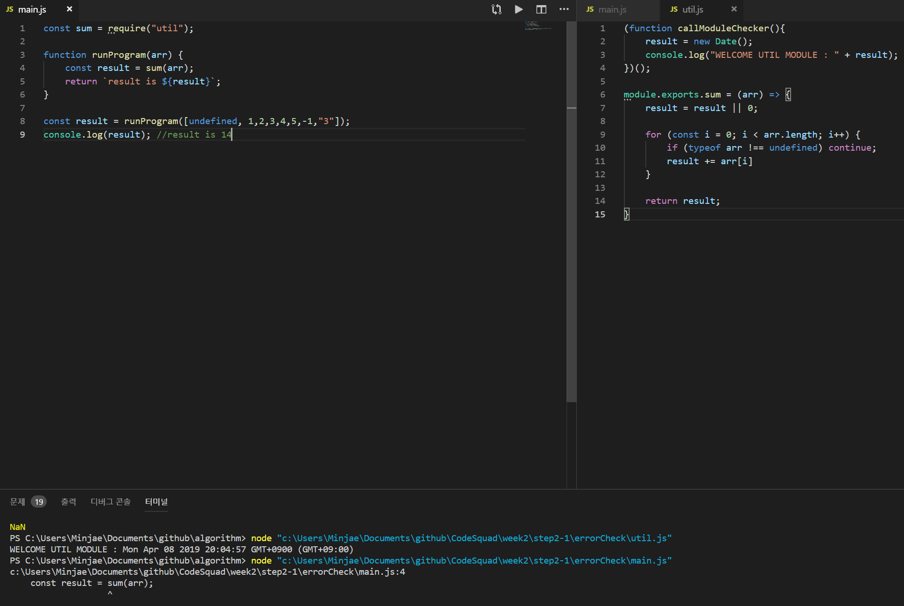
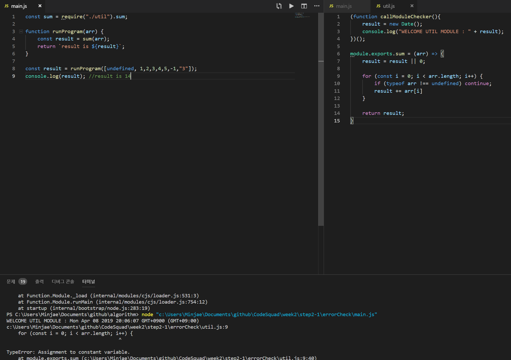
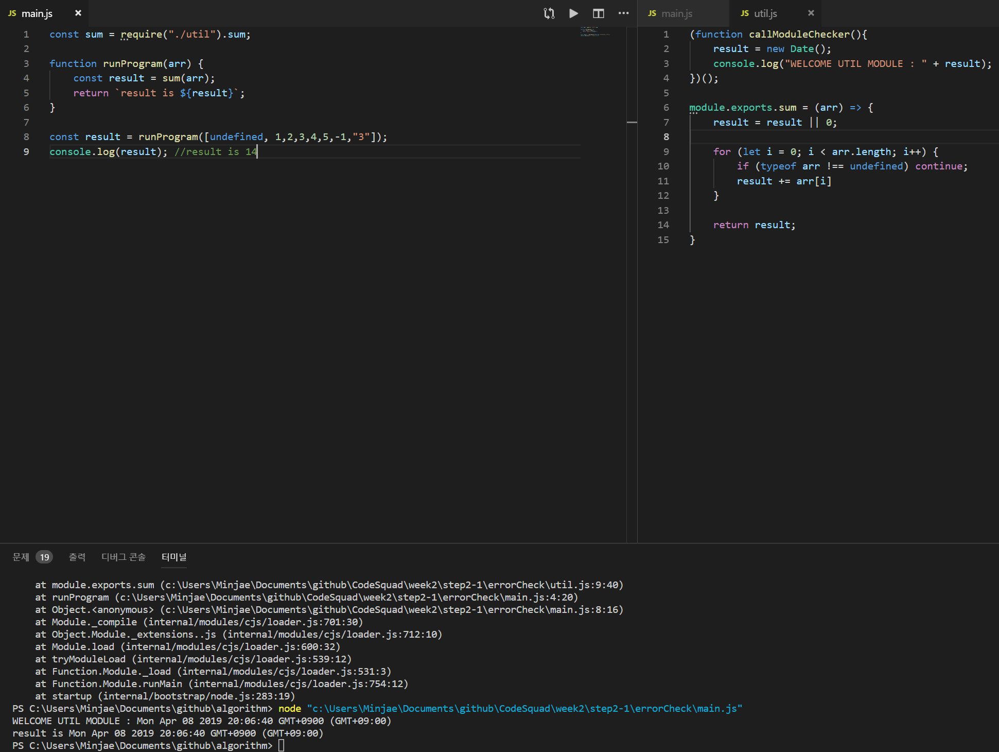
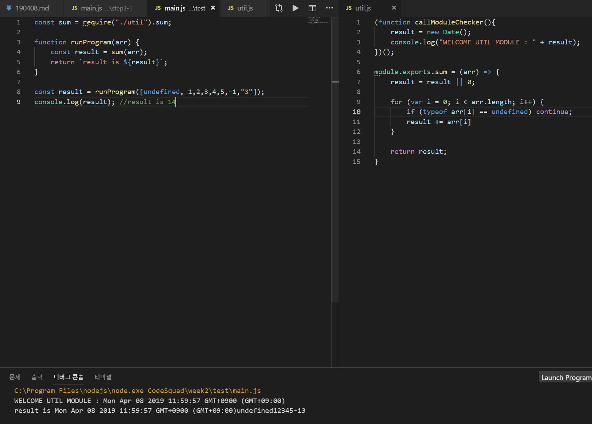
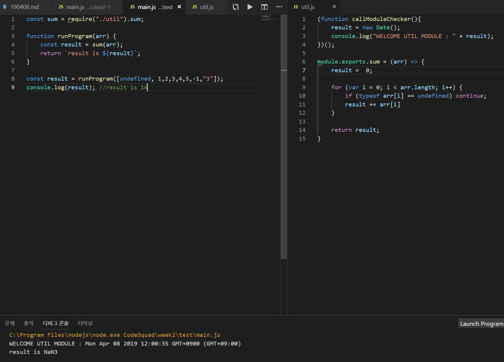
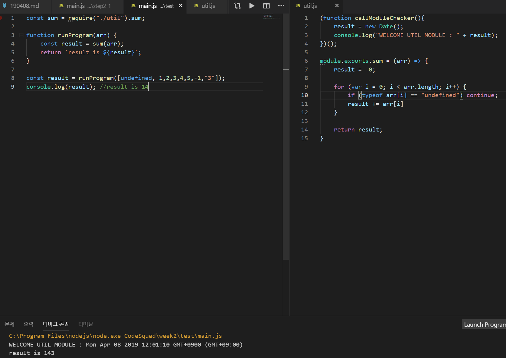
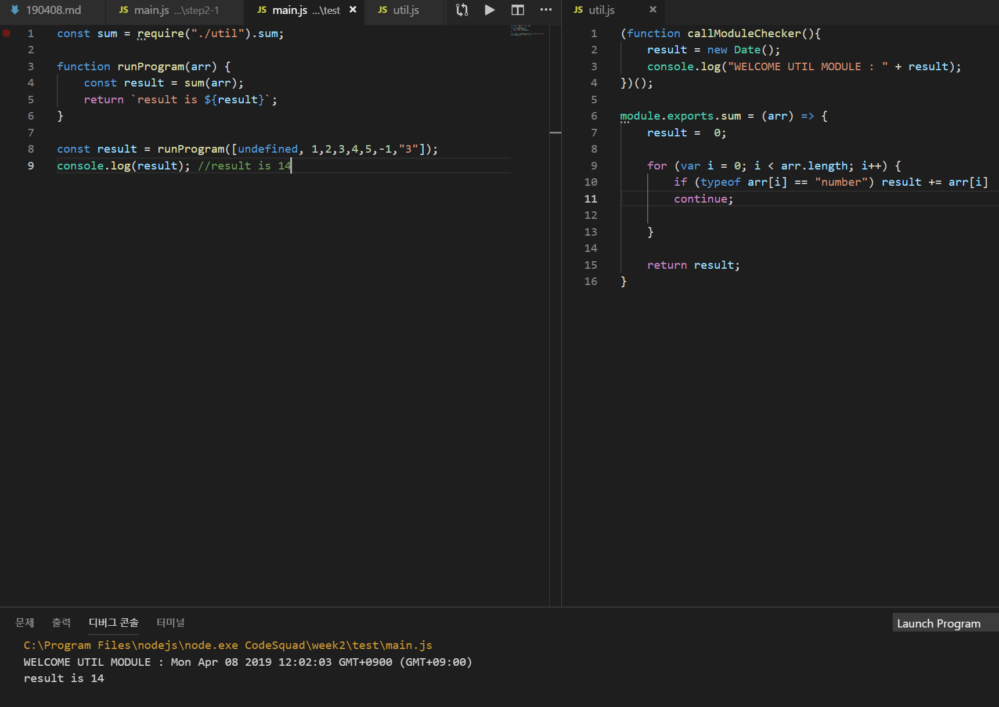
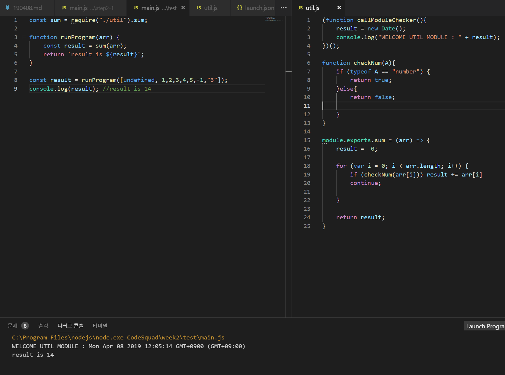

# 디버그 실습

1. 최초 코드

~~~
const sum = require("util");
-> 변경
const sum = require("./util").sum;
~~~

2. 두번쨰 코드 

~~~
for (const i = 0; i < arr.length; i++) {
-> 변경
for (let i = 0; i < arr.length; i++) {
~~~

3. 세번째 코드

~~~
if (typeof arr !== undefined) continue;
-> 
if (typeof arr[i] !== undefined) continue;
~~~

4. 네번째 코드

~~~
result =  result || 0;
->
result =  0;
~~~

5. 다섯번쨰 코드

~~~
if (typeof arr[i] !== undefined) continue;
->
if (typeof arr[i] !== "undefined") continue;
~~~

6. 여섯번쨰 코드

~~~
if (typeof arr[i] !== "undefined") continue;
result += arr[i]
->
if (typeof arr[i] !== "undefined") result += arr[i]
continue;
~~~

7. 일곱번쨰 코드

~~~
typeof arr[i] !== "undefined" 을 함수로 구현
->
function checkNum(A){
    if (typeof A == "number") {
        return true;        
    }else{
        return false;
    }
}
~~~

8. 완료 코드

main.js
~~~
const sum = require("./util").sum;

function runProgram(arr) {
    const result = sum(arr);
    return `result is ${result}`;
}

const result = runProgram([undefined, 1,2,3,4,5,-1,"3"]);
console.log(result); //result is 14
~~~

util.js
~~~
(function callModuleChecker(){
    result = new Date();
    console.log("WELCOME UTIL MODULE : " + result);
})();

function checkNum(A){
    if (typeof A == "number") {
        return true;        
    }else{
        return false;

    }
}

module.exports.sum = (arr) => {
    result =  0;

    for (let i = 0; i < arr.length; i++) {
        if (checkNum(arr[i])) result += arr[i]
        continue;
        
    }

    return result;
}
~~~