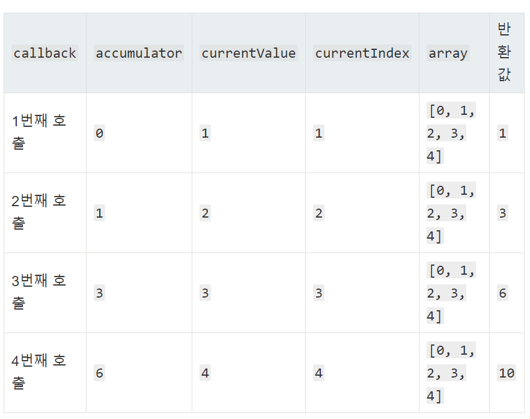

## 배열(Array) "[]"

------

### 배열 선언

```
var arr = new Array();
var arr = new Array(2);
var arr = [1,2,3];

```

### 배열 속성

Array.length

### 배열 메소드

##### 추가

###### array.push()

- 배열 마지막에 원소 추가

###### array = array.concat(['a','b'])

- 복수 원소 추가

###### array.unshift(0) 

- 첫번째 원소에 추가하고 기존값들 인덱스 1씩 추가

###### array.splice(start[,deleteCount[,item1[,item2]...]]

- start  : 배열의 변경을 시작할 인덱스

- deleteCount (optional) : 배열에서 제거를 할 요소의 수

- item1, item2, ...(optional) : 배열에 추가될 요소

  

###### 제거

```
array.shift(); // 첫번재 원소 제거
array.pop(); // 마지막 원소 제거
```

###### 정렬

```
array.sort(); //숫자의 경우 정상적으로 이루어지진 않는다
array.reverse(); //역순정렬

//숫자 정렬법
function sortNumber(a,b){
    return a-b;
}
array.sort(sortNumber);

//역순정렬
function sortNumber(a,b){
    return b-a;
}
array.sort(sortNumber);
```

###### array.forEach()

(callback[, thisArg])

매개변수

- callback
  - currentValue 처리할 현재 요소
  - index(optional) 처리할 현재 요소의 인덱스
  - array(optional) forEach를 호출한 배열
- thisArg(optional) callback 을 실행할때 this 로 사용할 값.

설명

- 주어진 callback 을 배열에 있는 각 요소에 대해 오름차순으로 한번씩 실행한다

  ```
  var sum = 0;  
  var arr = [5,13,8];  
  
  arr.forEach(function(item,index,array){  
    sum +=item;  
  });  
  
  console.log(sum);
  ```

###### array.map()

(callback(currentValue[, index[, array]]))[, thisArg]

매개변수

- callback : 새로운 배열 요소를 생성하는 함수, 다음 세가지 인수를 가진다
  - currentValue : 처리할현재 요소
  - index (optional) : 처리할 현재 요소의 인덱스
  - array (optional) : map()을 호출한 배열
- thisArg(optional) : callback 을 실행할때 this 로 사용되는 값

설명

- callback 함수를 각각 요소에 대해 한번씩 순서대로 불러 그 함수의 반환값으로 새로운 배열을 만든다

  ```
  var numbers = [1, 4, 9];
  var doubles = numbers.map(function(num) {
    return num * 2;
  });
  // doubles는 이제 [2, 8, 18]
  // numbers는 그대로 [1, 4, 9]
  ```

###### array.filter()

(callback(element[, index[, array]])[, thisArg])

매개변수

- callback : 각 요소를 시험할 함수, 다음 세가지 인수를 가진다
  - element : 처리할 현재 요소		
  - index(optional) : 처리할 현재 요소의 인덱스
  - array(optional) : filter 를 호출한 배열
- thisArg(optional) : callback을 실행 할 때 this 로 사용하는 값

설명 

- 주어진 판별 함수를 통과하는 요소를 모아 새로운 배열로 만들어 반환한다

  ```
  function isBigEnough(value) {
    return value >= 10;
  }
  
  var filtered = [12, 5, 8, 130, 44].filter(isBigEnough);
  // filtered 는 [12, 130, 44]
  ```

###### array.some()

(callback[, thisArg])

매개변수

- callback : 각 요소를 시험할 함수, 다음 세가지 인수를 받는다
  - currentValue : 처리할 현재 요소
  - index(optional) : 처리할 현재 요소의 인덱스
  - array(optional) : some 을 호출한 배열
- thisArg(optional) : callback을 실행 할 때 this 로 사용하는 값

설명

- callback이 어떤 배열 요소라도 ture를 반활 할 경우 true, 그 외 false

  ```
  function isBiggerThan10(element, index, array) {
    return element > 10;
  }
  [2, 5, 8, 1, 4].some(isBiggerThan10);  // false
  [12, 5, 8, 1, 4].some(isBiggerThan10); // true
  ```

###### array.every()

(callback[, thisArg])

매개변수

- callback : 각 요소를 시험할 함수, 다음 세가지 인수를 받는다
  - currentValue : 처리할 현재 요소
  - index(optional) : 처리할 현재 요소의 인덱스
  - array(optional) : some 을 호출한 배열
- thisArg(optional) : callback을 실행 할 때 this 로 사용하는 값

설명

- callback이 어떤 배열 요소라도 ture를 반활 할 경우 true, 그 외 false

  ```
  function isBiggerThan10(element, index, array) {
    return element > 10;
  }
  [12, 5, 8, 1, 4].every(isBiggerThan10);  // false
  [12, 15, 18, 11, 14].every(isBiggerThan10); // true
  ```

###### array.reduce()

매개변수

- callback : 각요소에 대해 실행할 함수, 다음 네가지 인수를 받는다
  - accumulator : 누산기는 callback의 반환값을 누적한다. callback 의 이전 반환값 or 콜백의 첫번째 호출, initialValue 를 제공한 경우엔 initialValue.
  - currentValue : 처리할 현재 요소
  - currentIndex(optional) : 처리할 현재 요소의 인덱스, initialValue 를 제공한 경우 0, 아니면 1부터 시작
  - array(opitional) : reduce를 호출한 배열
- initialValue(optional) : callback 의 최초 호출에서 첫번째 인수에 제공하는 값, 초기값을 제공하지 않으면 배열의 첫번째 요소를 사용한다.

설명

- reduce는 빈 요소를 제외하고 배열 내에 존재하는 각 요소에 대해 callback함수를 한 번 씩 실행한다.

  ```
  [0, 1, 2, 3, 4].reduce(function(accumulator, currentValue, currentIndex, array) {
    return accumulator + currentValue;
  });
  ```

  


## 객체(Object) ''{}''

------

- 배열과 유사한 역할
- 식별자로 key 를 사용
- key 와 value 로 이루어짐

### 선언

- 객체 key 값에는 ""가 필요없다

- 하지만 아래의 경우엔 오류발생

- ```
  var grades = {
      list : {name : '이민재', nickname : '왕민'},
       show : function(){
          console.log("Hello");
      }
  }
  console.log(grades[list]);// grades['list'] 가 되어야함 
  ```

  

```
var grade1 = {name : '이민재' , nickname : '왕민' };

var grade2 = ();
grade2['name'] = '이민재';
grade2['nickname'] = '왕민';

var grade3 = new Object();
grade2['name'] = '이민재';
grade2['nickname'] = '왕민';
```

### 속성에 접근

```
grade1['name']
grade1['na'+'me']
grade1.name
```

###### 데이터 추가

```
let friend = {key : 'value'};
friend.age = 20;
console.log(friend); //{ key: 'value', age: 20 }
```


### 탐색(반복문)

```
for(key in grade1){
	console.log(`key : ${key}, value : ${grade1[key]});
}
```

### 메소드

###### Object.keys(obj)

- 파라미터로 전달된 object에서 key 값을 문자열들을 요소로 갖는 배열을 반환한다

- 순서는 보장되지 않는다

  ```
  var arr = ['a', 'b', 'c'];
  console.log(Object.keys(arr)); // console: ['0', '1', '2']
  
  var anObj = { 100: 'a', 2: 'b', 7: 'c' };
  console.log(Object.keys(anObj)); // ['2', '7', '100']
  ```

###### Object.values(obj)

- 파라미터로 전달된 object 가 가지는 속성의 값(value)들로 구성된 배열을 반환한다

  ```
  var obj = { foo: 'bar', baz: 42 };
  console.log(Object.values(obj)); // ['bar', 42]
  	
  var obj = { 0: 'a', 1: 'b', 2: 'c' };
  console.log(Object.values(obj)); // ['a', 'b', 'c']
  ```

###### Object.entries(obj)

- 파라미터로 전달된 object 의 key 와 value 를 쌍으로([key,value]) 배열로 반환한다

  ```
  const obj = { foo: 'bar', baz: 42 };
  console.log(Object.entries(obj)); // [ ['foo', 'bar'], ['baz', 42] ]
  
  const obj = { 0: 'a', 1: 'b', 2: 'c' };
  console.log(Object.entries(obj)); // [ ['0', 'a'], ['1', 'b'], ['2', 'c'] ]
  ```

  

### 객체에 담길 수 있는것

- 이를 이용해서 객체를 그룹화 가능
- -> 객체지향 프로그래밍

```
var grades = {
    'list' : {name : '이민재', nickname : '왕민'},
    'show' : function(){
        console.log("Hello");
    }
}
console.log(grades['list']);
console.log(grades['list']['name']);
grades['show']();
```


